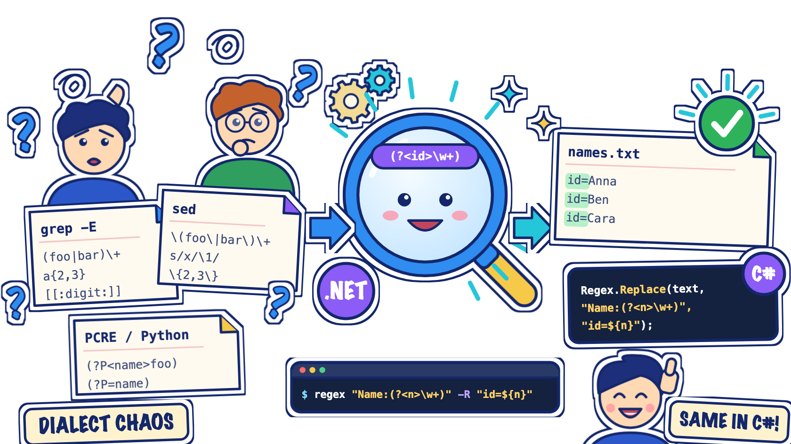

[](https://github.com/capjan/regex/actions/workflows/dotnet.yml)

# regex

Search and replace with **.NET regular expressions** from the command line, using the same engine as your C# code.



## Why not grep or ripgrep?

Use them for general text search, they are faster and more widely installed. Use `regex` when you need the .NET flavor:

- Try a pattern on the CLI, then paste it into C# unchanged. No dialect differences.
- .NET-only features such as balancing groups, and named groups in replacements (`--replace "id=${name}"`).
- Lookarounds and backreferences without extra flags or a separate engine.
- One tool with the same behavior on Linux, macOS and Windows, installed via `dotnet tool`.

## Features

- .NET Regular Expressions for CLI on Linux, macOS and Windows
- [.NET Tool](https://docs.microsoft.com/en-us/dotnet/core/tools/global-tools) Deployment
- [NuGet Package](https://www.nuget.org/packages/cap.regex/)
- Permissive [MIT License](./LICENSE)

## Install

Requires the [.NET 10](https://dotnet.microsoft.com/download) SDK or runtime.

```
dotnet tool install --global cap.regex
```

Update to the latest version:

```
dotnet tool update --global cap.regex
```

## Options

```
Usage:

  regex [<pattern> [<path>...]] [options]

Arguments:
  <pattern>  The search pattern as .NET Regular Expression (RegEx).
  <path>     File or directory to operate. (A directory must end with a directory separator)

Options:
  -R, --replace <replace>        replacement Pattern (regex)
  -c, --case-sensitive           enables case-sensitive behavior - btw. disables the by default enabled ignore-case option
  -f, --filter <filter>          wildcard based file filter, e.g. *.txt [default: *.*]
  -r, --recursive                progress all subdirectories
  --offset-width <offset-width>  output-formatting: set the count of characters used for the offset column [default: 6]
  -o, --only-matching            prints only the match
  -m, --max-count <max-count>    limit matches to the given count
  -v, --verbose                  show additional information
  -V, --version                  show version information
  -?, -h, --help                 Show help and usage information
```

Exit code is `0` on success and `1` on errors (e.g. missing pattern, invalid regular expression or invalid option value).

## Usage Examples

Find "Hello" in all *.txt files in this folder and all subfolders
```
C:>regex --recursive --filter *.txt Hello ./
```

Search case-sensitive
```
regex --case-sensitive Hello notes.txt
```

Replace with a named group (rewrites the file, files without matches stay untouched)
```
regex "Name:(?<name>[A-Za-z]+)" --replace "id=${name}" names.txt
```

## Changelog

See [CHANGELOG.md](./CHANGELOG.md).
